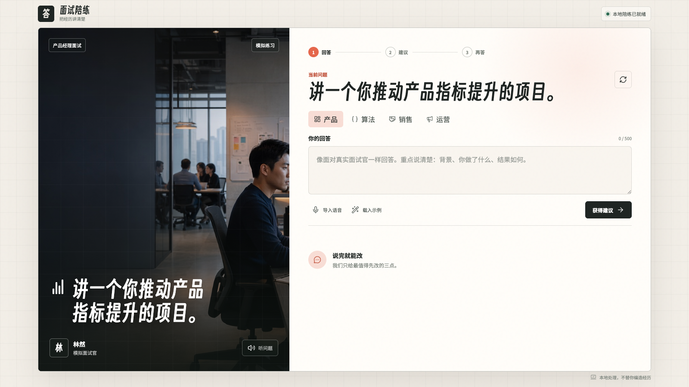
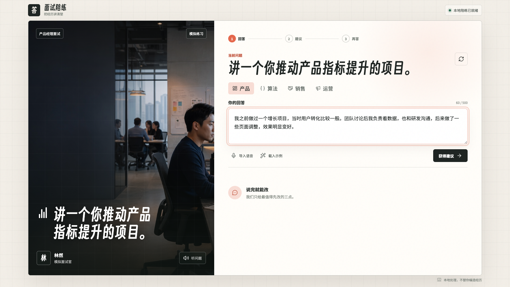
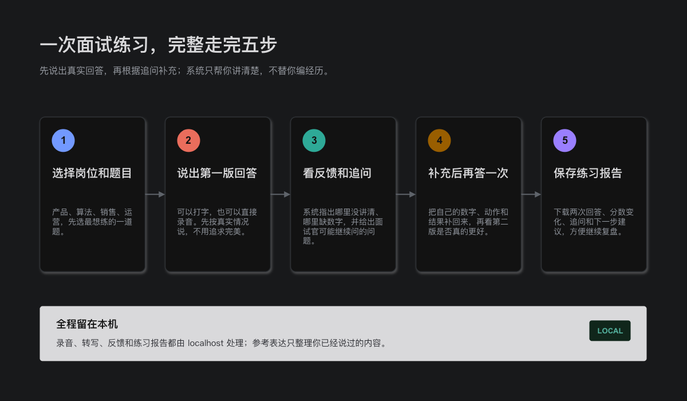
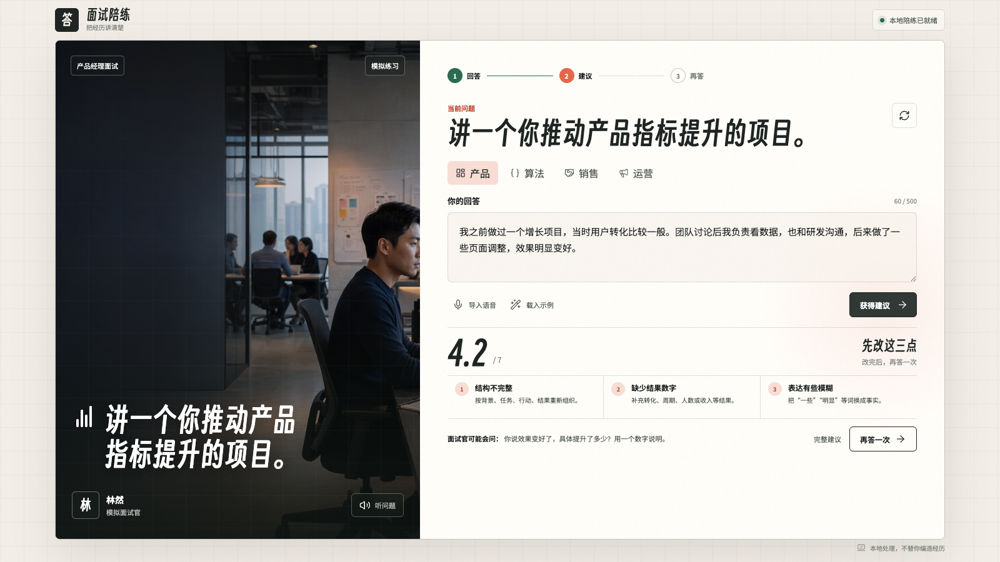
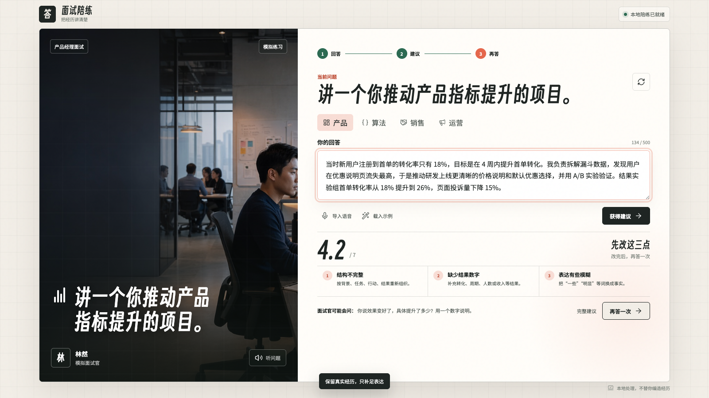
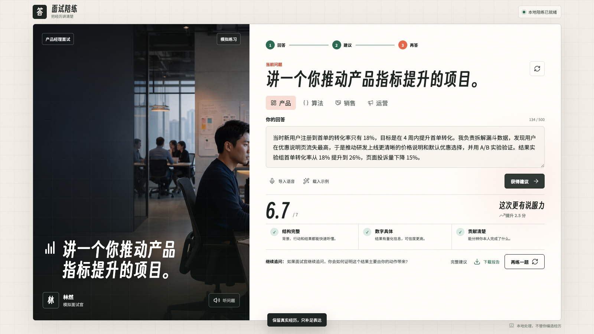
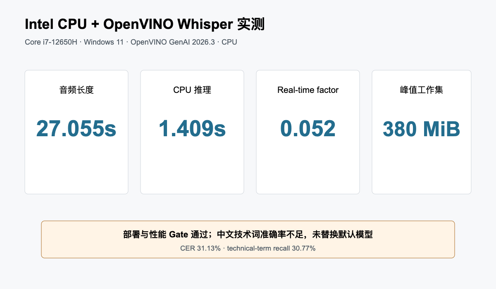
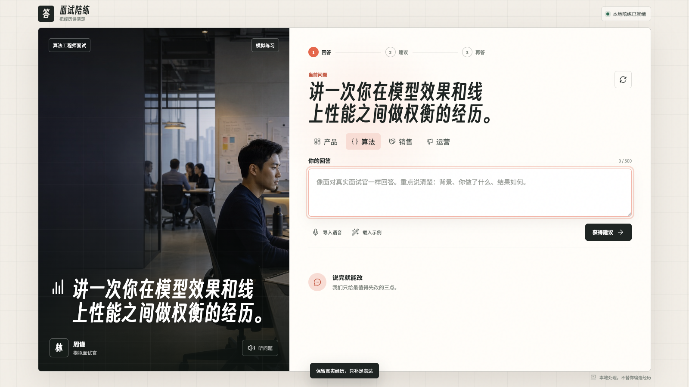
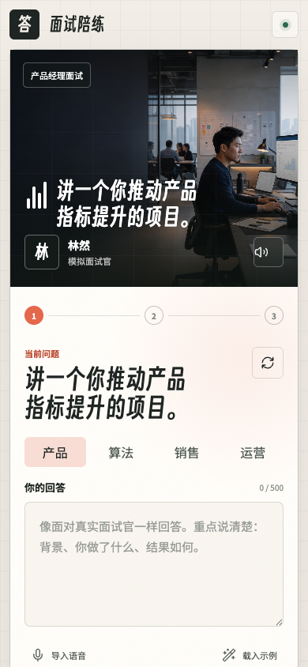
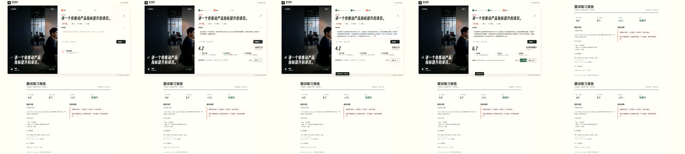

# 把面试复盘放到本地 AI PC：语音面试陪练 Agent Skill 的设计与实现

## 摘要

很多候选人在面试中并不缺少项目经历，真正困难的是如何在几分钟内把背景、目标、
个人行动和结果讲清楚。传统人工复盘依赖面试官或导师，反馈周期较长；通用大模型
虽然可以快速润色回答，却可能补入候选人没有提供的项目数据、团队规模和个人职责。
对于面试训练而言，一段更流畅但不真实的答案并没有实际价值。

本文实现了一套可在本地运行的语音面试陪练系统。候选人可以选择产品经理、算法
工程师、销售或运营岗位，通过文本或麦克风完成第一次回答。系统从 STAR 结构、
具体程度、数据量化、岗位匹配、表达清晰和真实可信六个方面分析回答，指出最需要
补充的信息，并给出针对性追问。候选人完成第二次回答后，系统展示总分和各维度的
变化，使“先回答、看反馈、补充、再回答、看变化”成为一套完整练习过程。

语音识别和评分服务运行在 localhost。当前中文默认路径使用轻量化 Moonshine
模型，OpenVINO GenAI Whisper 作为可选 provider 接入同一套 CLI 和服务接口。
系统同时封装为标准 Agent Skill，并在 Qoder CLI 1.1.30 和 TRAE CLI 0.120.47
中完成多次全新启动实测。8 组预设面试题测试全部通过，第二次回答平均提升 2.76 分；
localhost 文本评分接口连续 40 次调用无错误，本地语音回归也通过了预设质量门。

**关键词：** 面试陪练；Agent Skill；本地语音识别；OpenVINO；AI PC；
Hybrid AI

## 一、项目背景

### 1.1 回答里还没讲清楚的地方

下面是一段常见的产品经理面试回答：

> 我之前做过一个增长项目，当时用户转化比较一般。团队讨论后我负责看数据，
> 也和研发沟通，后来做了一些页面调整，效果明显变好。

这段话并非完全没有内容。候选人提到了项目背景、数据分析、跨团队协作和页面调整，
但面试官仍然无法判断四件事：原始指标是多少，候选人承担了什么具体责任，采用了
什么验证方法，最终结果是否可以量化。当面试官继续追问“具体提升了多少”时，回答
里没讲清楚的地方会立即暴露。

常见的面试辅助工具倾向于直接生成一份完整的 STAR 答案。这样做看似提高了表达
质量，却容易把“帮助候选人回忆和组织事实”变成“替候选人编写经历”。系统一旦
自动补入项目规模、团队人数、职责范围或业务结果，候选人就很难区分哪些内容来自
本人，哪些内容来自模型。

| 方式 | 主要输出 | 对缺失事实的处理 |
|---|---|---|
| 通用回答润色 | 直接生成一版更完整的回答 | 容易把建议内容写成候选人经历 |
| 本项目 | 定位缺口、继续追问、比较两次回答 | 缺失信息保留为待补充项，不自动代填 |

因此，本项目没有把目标设定为“生成一份高分答案”，而是帮助候选人完成一次真实的
修改过程：

1. 保留第一次回答的原文；
2. 指出回答中最具体的问题；
3. 用追问帮助候选人补充自己的事实；
4. 对比两次回答发生了哪些变化；
5. 缺少的信息保持缺少，不由系统代填。



### 1.2 使用场景

系统面向需要反复练习行为面试和项目面试的人群，包括校招候选人、转岗求职者、
销售与运营人员，以及需要为团队提供面试培训的企业导师。一次练习通常在几分钟内
完成，候选人不需要上传简历，也不需要建立长期个人档案。

当前题库覆盖四类岗位，每个岗位配置两道典型问题：

| 岗位 | 典型问题 |
|---|---|
| 产品经理 | 指标提升、跨团队分歧推进 |
| 算法工程师 | 效果与延迟权衡、线上效果下降排查 |
| 销售 | 关键客户异议、销售漏斗管理 |
| 运营 | 增长活动、线上运营事故 |

这些问题都要求候选人说明“当时发生了什么、本人做了什么、结果如何”，适合用两轮
回答观察改进效果。

### 1.3 设计目标

围绕这条练习流程，系统需要满足以下要求：

- 反馈必须具体到缺失结构、指标、岗位动作或个人贡献；
- 参考表达只能整理原回答中的事实，不能自动补写经历；
- 相同输入应产生稳定结果，便于比较前后两次回答；
- 原始录音、转写和评分可以在本机完成；
- 浏览器、CLI 和生产力 Agent 使用同一套能力；
- 模型或转写质量不足时，系统应明确提示复核，而不是继续给出看似确定的结论。

## 二、系统总体设计

### 2.1 产品工作流

系统把一次练习拆成五步。

第一步，候选人选择岗位和问题。第二步，通过文本或浏览器麦克风提交第一次回答。
第三步，系统展示六方面反馈、主要问题、追问和参考回答框架。第四步，候选人补充内容
后再次回答，系统展示前后差值。第五步，候选人下载本地 Markdown 练习报告，用于
后续复盘，或交给导师和企业培训人员查看。



这条流程没有要求候选人一次就说出完整答案。第一次回答的作用是暴露问题，第二次
回答才用于验证反馈是否有效。前端只保留练习所需的信息：当前问题、回答输入、
主要问题、一个优先追问和前后对比，避免把候选人淹没在大量分析文字中。



### 2.2 系统架构

系统由浏览器工作台、localhost 服务、语音识别 provider、规则化反馈引擎和
Agent Skill 适配层组成。

```text
浏览器麦克风 / 文本输入 / Agent 调用
                 |
                 v
        localhost 常驻服务
                 |
          +------+------+
          |             |
      Moonshine     OpenVINO Whisper
      默认中文路径     可选 provider
          |             |
          +------+------+
                 |
                 v
       转写归一化与质量检查
                 |
                 v
          六方面反馈与问题类别
                 |
                 v
       追问 + 参考回答框架
                 |
                 v
         第二次回答差值比较

Qoder / TRAE
      |
      v
SKILL.md -> scripts/interview.py -> 同一服务与返回格式
```

localhost 服务提供四个接口：

```text
GET  /v1/status
GET  /v1/interview/roles
POST /v1/interview/coach
POST /v1/interview/report
POST /v1/interview/transcribe
```

浏览器、CLI、Qoder 和 TRAE 最终使用同一套反馈逻辑，返回格式由 JSON Schema
约束。这样可以避免网页显示一种结果、其他工具返回另一种结果，也便于在不同入口之间
复用相同的题目、反馈和报告。

OpenVINO GenAI Whisper 不是独立演示脚本，而是已经接入 `transcribe` 命令和
localhost 服务的实际 provider。由于当前中文准确率尚未通过默认模型替换门槛，
产品仍使用 Moonshine 作为默认路径。两种 provider 使用相同的转写格式和后续反馈
流程。

### 2.3 本地常驻服务

文本练习不需要加载语音模型，使用系统 Python 即可运行。语音练习由服务进程按需
加载模型，并在后续请求中复用，避免每次录音都重新初始化模型。浏览器录音只发送到
`127.0.0.1`，服务默认不监听公网地址，也不执行任何系统命令。

对于个人练习，这种 Client/Server 方式有两个直接好处：浏览器交互保持轻量，
Qoder、TRAE 等工具也可以通过稳定的 localhost 接口重复使用同一项能力。

## 三、核心功能实现

### 3.1 六方面反馈

系统没有让大模型直接给出一个难以解释的总分，而是从回答中提取可复现特征，再按
六个方面给出反馈。

| 维度 | 输出字段 | 检查内容 |
|---|---|---|
| STAR 结构 | `structure` | 是否说明背景、任务、行动和结果 |
| 具体程度 | `specificity` | 是否包含对象、范围、周期和具体动作 |
| 数据量化 | `metrics` | 是否提供指标、规模、人数、时间或金额 |
| 岗位匹配 | `role_fit` | 是否出现与目标岗位相关的专业动作 |
| 表达清晰 | `clarity` | 是否存在模糊词、填充词或跳跃表达 |
| 真实可信 | `risk_control` | 是否说清本人贡献，有没有夸大或把团队成果都算在自己身上 |

反馈引擎提取 STAR 关键词、岗位词汇、数字与单位、第一人称行动、结果句、风险表达、
句子数量和模糊词等特征。总分用于展示改进幅度，固定问题标签则用来给出具体反馈。

系统当前使用的主要问题标签包括：

```text
STAR_INCOMPLETE  回答缺少背景、任务、行动或结果
NO_METRIC        没有量化结果或规模
LOW_ROLE_FIT     岗位相关动作不足
VAGUE_LANGUAGE   存在模糊表达
NO_OWNERSHIP     个人贡献不清楚
ASR_REVIEW_REQUIRED  转写质量不足，需要人工核对
```

固定的问题类别比随意生成的一段文字更适合工程使用。前端可以稳定显示问题类型，工具也可以据此
决定下一步追问，用户也能清楚看到两次回答解决的是不是同一类问题。

### 3.2 从问题定位到追问

前面的产品经理回答是网页和 Agent 演示使用的完整首答样例，评分为 4.2。系统识别
到三个主要问题：

```text
STAR_INCOMPLETE  缺少结果
NO_METRIC        没有量化结果或规模
VAGUE_LANGUAGE   出现“一些、比较、明显”等模糊词
```

系统不会一次展示十几条建议，而是把最影响回答质量的问题放在前面，并给出能够继续
回答的追问：

```text
你说效果变好了，具体提升了多少？用一个数字说明。
最后结果是什么？上线、成交、通过或指标变化分别是多少？
请按背景、任务、行动、结果四段重新讲一遍。
```



这种反馈方式尽量把抽象评价转化为候选人可以立即补充的信息。“表达不够具体”很难
直接修改，“首单转化率从多少提升到多少”则对应一个明确的回忆任务。

### 3.3 参考回答框架的事实约束

系统生成的不是一份替候选人完成的标准答案，而是一份参考回答框架。已经出现的事实
可以被重新排序；原回答中不存在的信息必须保留为待补充项。例如：

```text
背景：新用户转化表现一般。
任务：负责分析数据并推动页面调整。
行动：查看数据，与研发沟通，完成页面优化。
结果：[补充一个可核实的指标和结果]
```

系统不会自动填写雇主名称、团队人数、项目金额、个人职责、证书、转化数据或收入
结果。这条规则同时存在于评分逻辑、Skill 说明和固定测试集中。8 组预设面试题测试都会检查
参考框架是否基于首答、缺失结果是否显式保留，以及是否出现预设的虚构行动模板。

### 3.4 第二次回答与差值

候选人根据追问补充事实后，可以提交第二次回答：

> 当时新用户注册到首单的转化率只有 18%，目标是在 4 周内提升首单转化。
> 我负责拆解漏斗数据，发现用户在优惠说明页流失最高，于是推动研发上线更清晰的
> 价格说明和默认优惠选择，并用 A/B 实验验证。结果实验组首单转化率从 18%
> 提升到 26%，页面投诉量下降 15%。



系统对两次回答使用同一套评分器，输出总分和逐维度差值：

```text
structure     +1
specificity   +3
metrics       +6
role_fit      +2
clarity       +2
risk_control  +1
```

总分由 4.2 提升到 6.7，六个方面均未下降。相比只展示一个最终分数，差值能够说明
候选人究竟改好了什么：补充了数字，明确了个人行动，也让结果与前面的目标形成对应。



### 3.5 可归档的练习报告

完成第二次回答后，网页会显示“下载报告”按钮。报告由 localhost 服务根据同一份
回答重新评分并生成，而不是直接信任浏览器中的展示数据。这样，CLI、网页和 Agent
得到的报告口径一致。


Markdown 报告包含：

- 当前岗位、问题和练习轮次；
- 第一次与第二次回答原文；
- 总分和六个方面的变化；
- 首答主要问题与建议追问；
- 当前最弱的两个维度和下一次练习动作；
- 参考表达结构与注意事项。

候选人可以把报告放入自己的求职资料目录，导师可以据此安排下一轮追问，企业培训
人员也可以收集脱敏后的报告进行复盘，而不需要保存原始录音。仓库提供
`examples/interview-coach/pm-practice-report.md` 作为完整样例。

### 3.6 中文数字归一化

中文语音识别经常把 `18%` 转写为“百分之十八”，把 `4 周` 转写为“四周”。如果
评分器只识别阿拉伯数字，候选人已经说出指标时仍可能被误判为 `NO_METRIC`。

因此，系统在评分前统一处理空格、中文数字、百分数和常见单位，使文本输入和语音
输入尽量进入一致的评分路径。该步骤不改变回答含义，只把不同书写形式转换为评分器
能够稳定处理的格式。

## 四、本地语音识别与 OpenVINO 适配

### 4.1 Moonshine 中文默认路径

当前中文语音默认使用量化版 Moonshine 模型。模型文件约 141 MB，适合在普通个人
电脑上运行。服务启动时可以预加载模型：

```bash
.venv-moonshine/bin/python scripts/interview.py service --preload zh
```

一次本地回归使用 16.336 秒中文回答，结果如下：

| 指标 | 结果 |
|---|---:|
| 音频时长 | 16.336 秒 |
| 本地推理时间 | 0.651056 秒 |
| 实时系数 RTF | 0.039854 |
| 归一化字符覆盖率 | 100% |
| 归一化字符精确率 | 100% |
| 回答评分 | 6.0 / 7 |

该音频由 macOS 本地 Tingting 音色生成，语速为 120，用于稳定回归而非真人用户
研究。上述覆盖率和精确率只描述这一条回归样本。CLI 和 localhost 两条路径都通过
了 90% 的转写质量门。

系统还使用本地 VoxCPM2 TTS 生成了一组首答和二答语音，验证语音生成、ASR、反馈
和前后对比的整套流程：

| 语音回答 | 音频时长 | RTF | 分数 |
|---|---:|---:|---:|
| 第一次回答 | 3.84 秒 | 0.031928 | 3.0 |
| 第二次回答 | 17.60 秒 | 0.043800 | 6.3 |

这组实验的分数提升为 3.3，说明语音输入能够进入与文本输入一致的练习流程。

### 4.2 转写质量门

语音识别速度快并不意味着文本一定可用。对于带参考文本的回归音频，系统计算归一化
字符覆盖率；覆盖率低于 90% 时返回 `ASR_REVIEW_REQUIRED`，要求先核对转写，再
使用评分结果。

在真实练习中没有参考文本时，前端会保留完整转写，候选人可以在评分前检查或修正。
系统不会把明显错误的转写隐藏起来，也不会把 ASR 错误解释成候选人的表达问题。

### 4.3 OpenVINO GenAI Whisper

为了适配 Intel AI PC，项目将 OpenVINO GenAI Whisper 接入当前产品的 CLI 和
localhost 服务。用户可以显式选择 provider：

```bash
python3 scripts/interview.py transcribe \
  --audio answer.wav \
  --language zh \
  --asr-provider openvino \
  --openvino-model-dir models/openvino/whisper-tiny-int8-ov \
  --openvino-device CPU
```

模型准备脚本优先支持从 ModelScope 下载，减少部分网络环境对 Hugging Face 的
依赖。OpenVINO provider 与 Moonshine 使用同一份转写输出格式，因此上层评分器、
浏览器和 Agent Skill 不需要感知后端差异。

在开发机上，17.60 秒测试音频完成了 CLI 和 localhost 两条功能路径：

| 调用路径 | 推理时间 | RTF |
|---|---:|---:|
| CLI | 0.189693 秒 | 0.010778 |
| localhost 服务 | 0.268175 秒 | 0.015237 |

该开发机是 Apple Silicon，因此这组数据只用于确认 provider 能加载、转写并接入
产品接口，不作为 Intel 性能结果。转写中出现了“手单转化律”等错误，导致
`STAR_INCOMPLETE` 和 `LOW_ROLE_FIT`。这说明功能接入已经完成，但当前准确率还不适合
替换默认中文模型。

### 4.4 Intel CPU 实测

项目随后在一台 Intel Core i7-12650H、Windows 11 笔记本上运行
OpenVINO 2026.3 和 Whisper Base INT8。27.055 秒音频的总推理时间为
1.409 秒，RTF 为 0.0521。



准确率测试使用的是包含“缓存命中率、灰度、限流”等词汇的事故术语压力集，不是
面试语料。该压力集上的 CER 为 31.13%，技术词召回率为 30.77%。因此，这组实验
能够说明 OpenVINO Whisper 已在 Intel CPU 上完成部署，并获得了一次同机单样本
测量结果，但不能据此推断整体性能，也不能说明其中文面试转写已经达到产品默认标准。

基于当前结果，产品继续使用 Moonshine 作为中文默认路径，OpenVINO Whisper 保留
为可选 provider。相比只报告速度，这个结论同时保留了模型的准确率边界。项目目前
没有 Intel GPU/NPU 的同一 workload 数据，因此不声明相关性能。

## 五、Agent Skill 封装与 Qoder、TRAE 实测

### 5.1 Skill 接口

仓库根目录提供标准 `SKILL.md`，并为 Qoder 和 TRAE 配置同名 Skill。Agent
不需要理解评分引擎内部实现，只需调用稳定的 CLI：

```bash
python3 scripts/interview.py roles

python3 scripts/interview.py coach \
  --input examples/interview-coach/pm-second-answer.json

python3 scripts/interview.py report \
  --input examples/interview-coach/pm-second-answer.json \
  --output build/agent-report-evidence/report.md \
  --overwrite
```

`roles` 返回岗位和问题，`coach` 接收第一次回答或两次回答并返回结构化结果，
`report` 将同一结果写成可归档的 Markdown。语音模式可以先调用 `transcribe`，
也可以直接使用 localhost 服务。

将能力封装为 Skill 后，Qoder、TRAE 等工具可以完成四类任务：

- 根据目标岗位列出练习题；
- 对单次回答给出问题标签和追问；
- 批量比较多次练习结果并生成进步摘要；
- 导出包含两次原文、六方面变化和后续建议的 Markdown 练习报告。

Agent 只能调用练习工具，不能把结果用于自动筛选候选人，也不能凭空补充候选人的
个人经历。

报告是当前工作流的最终产物。候选人可以保存自己的练习记录，导师可以根据报告
继续追问，企业培训人员也可以在不收集原始录音的前提下查看结构化复盘。报告默认
只在本地生成，不建立服务器侧候选人档案。

### 5.2 Qoder 调用

Qoder CLI 1.1.30 使用阿里云百炼模型作为 Agent 规划模型，实际加载
`interview-coach-agent` Skill，并依次调用 `roles`、`coach` 与 `report`。

一次调用返回：

```text
岗位数量：       4
第一次回答：     4.2
第二次回答：     6.7
总分变化：       +2.5
结论：           improved
退步维度：       0
报告文件：       build/agent-report-evidence/qoder-run-01.md
```

为排除历史上下文影响，项目又进行了 3 次全新启动，并使用
`--no-session-persistence` 参数。
三次均完成 Skill 加载和三条命令调用，并复现 4.2、6.7 和 +2.5 的结果，成功率
为 3/3，每轮都生成了结构一致的 Markdown 练习报告。

### 5.3 TRAE 调用

TRAE CLI 0.120.47 使用三个独立会话执行同一任务。三次会话均完成
`roles → coach → report`，返回 4.2、6.7、+2.5 和 `improved`，并生成对应报告。

| 工具 | 全新启动次数 | 完成流程 | 结果 |
|---|---:|---:|---|
| Qoder CLI 1.1.30 | 3 | 3 / 3 | 4.2 → 6.7 |
| TRAE CLI 0.120.47 | 3 | 3 / 3 | 4.2 → 6.7 |

两个工具都能稳定发现 Skill、调用同一套本地能力并生成练习报告。



这组验证关注的是 Skill 能否被 Agent 稳定发现和调用，而不是比较不同 Agent 的
语言能力。Qoder 和 TRAE 最终使用同一份本地工具输出，因此评分结果保持一致。

## 六、实验设计与结果

### 6.1 多岗位预设题测试

预设测试覆盖四个岗位、8 个不同问题。每组测试都包含第一次回答和补充事实后的第二次
回答。表中的“指标提升”使用预设测试里更短的第一次回答，因此首答为 3.2；前文网页和 Agent
演示使用的是信息稍多的首答样例，分数为 4.2。两者问题相同，但输入文本不同。

| 场景 | 岗位 | 首答 | 二答 | 提升 |
|---|---|---:|---:|---:|
| 指标提升 | 产品经理 | 3.2 | 6.7 | +3.5 |
| 研发分歧推进 | 产品经理 | 4.0 | 6.3 | +2.3 |
| 效果与延迟权衡 | 算法工程师 | 4.0 | 6.7 | +2.7 |
| 模型效果下降排查 | 算法工程师 | 3.7 | 6.3 | +2.6 |
| 关键客户异议 | 销售 | 3.3 | 6.5 | +3.2 |
| 销售漏斗管理 | 销售 | 4.2 | 6.5 | +2.3 |
| 增长活动 | 运营 | 3.8 | 6.7 | +2.9 |
| 线上运营事故 | 运营 | 3.7 | 6.3 | +2.6 |

8 组测试全部通过，平均提升 2.76 分。每组测试同时检查：

- 第二次回答达到预设的最低提升；
- 六个方面没有倒退；
- 第一次回答的参考框架只使用原文事实；
- 缺失结果使用显式占位符；
- 没有出现预设的虚构行动模板。

评测不只替换岗位名称。算法案例需要说明模型效果和在线延迟的权衡，销售案例涉及
客户异议和分阶段成交，运营案例包括活动增长和线上事故，产品案例则覆盖指标提升与
跨团队推进。

### 6.2 localhost 服务稳定性

项目对 `/v1/interview/coach` 执行五轮连续调用，每轮运行全部 8 组预设测试。

| 指标 | 结果 |
|---|---:|
| 请求数 | 40 |
| 通过数 | 40 |
| 成功率 | 100% |
| 错误数 | 0 |
| 中位延迟 | 0.001739 秒 |

这里的延迟只统计规则化文本反馈，不包含 ASR。把文本反馈和语音转写分开记录，可以
避免用一个很小的数掩盖模型加载和音频推理时间。

### 6.3 不同回答风格的模拟实验

为了观察系统面对较长、较自然回答时的表现，项目使用语言模型模拟产品经理、算法
工程师和销售候选人。模拟候选人先生成第一次回答，读取系统实际返回的问题和追问，
再生成第二次回答。

| 模拟角色 | 首答 | 二答 | 提升 |
|---|---:|---:|---:|
| 产品经理 | 4.5 | 6.3 | +1.8 |
| 算法工程师 | 5.2 | 6.3 | +1.1 |
| 销售 | 4.7 | 6.2 | +1.5 |

三组均有提升，平均提升 1.467。该实验属于语言模型角色模拟，用于扩大回答风格覆盖，
不是真人用户研究，也不用于推断真实候选人的学习效果。

### 6.4 端到端验证

除了回答质量，项目还分别验证了语音、服务和 Qoder/TRAE 调用：

| 验证项 | 结果 |
|---|---|
| 预设面试题测试 | 8 / 8 通过 |
| localhost 文本评分 | 40 / 40 通过 |
| Moonshine 回归音频 | 单条合成回归音频覆盖率 100%，RTF 0.039854 |
| VoxCPM2 生成语音 | 二答较首答提升 3.3 |
| Qoder 全新启动实测 | 3 / 3 完成 `roles → coach → report` |
| TRAE 全新启动实测 | 3 / 3 完成 `roles → coach → report` |
| Markdown 练习报告 | CLI、localhost 与浏览器下载通过 |

### 6.5 界面与演示

工作台分别在 1600×900 桌面视口和 390×844 移动视口进行布局检查。桌面和移动端
均无横向溢出，移动端保留岗位、问题、录音和回答入口。



演示视频时长 38.60 秒，展示正式样例从 4.2 提升到 6.7，并点击下载按钮打开
Markdown 练习报告。



## 七、部署与使用

### 7.1 公开入口

项目的源码、Skill 和演示视频可以从以下入口查看：

- [ModelScope Skill 页面](https://www.modelscope.cn/skills/ayuannn/interview-coach-agent)
- [公开源码与复现材料](https://github.com/Chengyuann/interview-coach-agent)
- [38.6 秒演示视频](https://github.com/Chengyuann/interview-coach-agent/blob/main/demo/interview-coach-demo-v2.mp4)

### 7.2 文本模式

文本模式不需要语音模型：

```bash
python3 -m venv .venv-minimal
.venv-minimal/bin/python -m pip install -r requirements-minimal.txt

.venv-minimal/bin/python scripts/interview.py roles
.venv-minimal/bin/python scripts/interview.py coach \
  --input examples/interview-coach/pm-second-answer.json

.venv-minimal/bin/python scripts/interview.py report \
  --input examples/interview-coach/pm-second-answer.json \
  --output build/interview-practice-report.md \
  --overwrite
```

### 7.3 AIPC local Skill 入口

Windows 端采用短生命周期客户端和本地常驻服务的结构：

```powershell
scripts\run.ps1 roles
scripts\run.ps1 report `
  --input examples\interview-coach\pm-second-answer.json `
  --output build\interview-practice-report.md `
  --overwrite
```

`run.ps1` 是 Windows Host 固定入口，先执行可选 AIPC 硬件门，再由
`install-env.ps1` 准备本地 venv，随后启动短生命周期 `client.py`。客户端通过
named pipe 调用常驻 `server.py`，服务端暴露 `status`、`request` 和 `shutdown`
三类标准操作。模型先写入 `.partial` 目录，校验 `info.json` 中的 `required_files`
后再原子落盘；首次准备超过工具单次调用时限时，客户端保存 pending request，并提示
运行 `scripts\run.ps1 --continue` 继续。

项目同时保留 `scripts/interview.py` 和浏览器 localhost 路径，用于跨平台开发
和日常练习；Windows Skill 入口是 `scripts\run.ps1`。

### 7.4 本地语音工作台

安装 Moonshine 环境并准备模型：

```bash
python3 scripts/install_moonshine_env.py
.venv-moonshine/bin/python scripts/prepare_moonshine_models.py
.venv-moonshine/bin/python scripts/interview.py service --preload zh
```

浏览器访问：

```text
http://127.0.0.1:8876
```

### 7.5 OpenVINO 模式

OpenVINO 是显式可选项。安装依赖、准备模型后，通过
`--asr-provider openvino` 和 `--openvino-device` 选择运行设备。Windows 目录
还提供一键 PowerShell 脚本，用于安装标准 CPython 环境、下载模型、检测
OpenVINO 设备并生成结果包。

项目曾遇到 Anaconda 自带旧版 `MSVCP140.dll` 导致 OpenVINO GenAI 原生崩溃。
当前 Windows 脚本会拒绝 Anaconda/Miniconda Python，改用标准 CPython 创建独立
虚拟环境，避免动态库冲突。

## 八、数据安全与 Hybrid AI

### 8.1 本地处理范围

以下数据默认留在本机：

- 浏览器录音和回答文本；
- ASR 转写；
- 六方面反馈与固定问题标签；
- 参考回答框架；
- 两次回答的差值。

服务只绑定 loopback 地址，不扫描简历目录，不建立候选人画像，不执行系统命令，
也不把练习分数用于招聘录用判断。

### 8.2 云端能力范围

在用户明确授权并完成脱敏后，云端模型可以承担以下任务：

- 根据公开岗位描述扩展练习题；
- 生成不同面试官风格的追问；
- 补充公开行业知识；
- 作为 Qoder 或 TRAE 的规划模型调用本地 Skill。

原始回答、评分和对比结果仍由本地服务处理。没有网络时，文本评分、本地语音和
第二次回答对比仍可运行。

这种 Hybrid AI 分工不是把所有能力都放在云端，也不是为了本地化而拒绝云端。
隐私敏感、需要低延迟和重复调用的环节留在本机，公开知识和复杂语言规划按需交给
云端。

### 8.3 许可证说明

OpenVINO 运行时和所用 Whisper 模型路径有独立许可证记录。Moonshine 中文权重
使用 Moonshine AI Community License，包含单独的商业条件和署名要求。企业部署
前需要再次核对适用范围。

因此，项目将“能够在本地运行”和“可以不受条件地商用”分开说明。部署时模型按需
下载，使用者也可以根据许可和准确率要求替换 ASR provider。

## 九、局限与后续工作

当前版本仍有明确限制。

第一，六方面反馈适合发现结构、数字、岗位动作和表达问题，不能完整判断业务策略是否
正确，也不能代替专业面试官。

第二，语音识别仍会受口音、环境噪声、英文缩写和长句影响。质量门只能阻止明显错误
继续传播，不能消除所有转写偏差。

第三，OpenVINO Whisper 已进入当前产品路径，并在 Intel CPU 上完成部署测试，
但中文准确率还没有达到默认替换标准。Intel GPU/NPU 的同一 workload 尚未测试。

第四，当前结果来自预设样例、生成语音和语言模型角色模拟，尚未形成真人候选人的
限时对照实验。后续需要记录真人首答、阅读反馈、二答、完成时间和主观可用性，才能
评估真实学习效果。

第五，当前岗位库只有四类岗位、八道问题。扩展题库时需要同时增加岗位词表、问题
模板和预设样例，不能只增加前端选项。

## 十、总结

本项目实现了一套运行在本地 AI PC 上的语音面试陪练 Agent Skill。候选人先完成
第一次回答，系统指出结构、数字、岗位动作，以及有没有夸大或没说清本人贡献的问题，再通过追问引导候选人
补充自己的经历，最后比较第二次回答的变化。

系统用结构化输出守住三条原则：缺少结果时保留待补充项，转写质量不足时要求复核，
OpenVINO 路径准确率不够时不替换默认模型。

当前版本完成了 Moonshine 本地语音流程、OpenVINO GenAI Whisper 可选 provider、
Intel CPU 实测、Qoder 与 TRAE 多次全新启动调用、8 组跨岗位预设测试、localhost
稳定性测试。它可以作为个人面试练习工具，也可以嵌入企业培训和求职辅导流程，但其
定位始终是帮助用户整理和表达真实经历，而不是生成一段看似完美的虚构答案。

<!-- publication asset: interview-coach-demo-v2.mp4 -->
